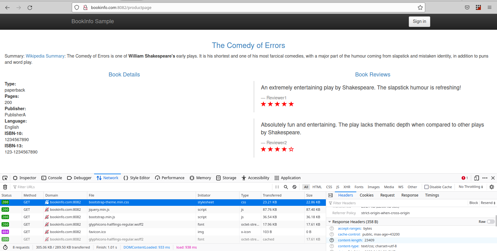
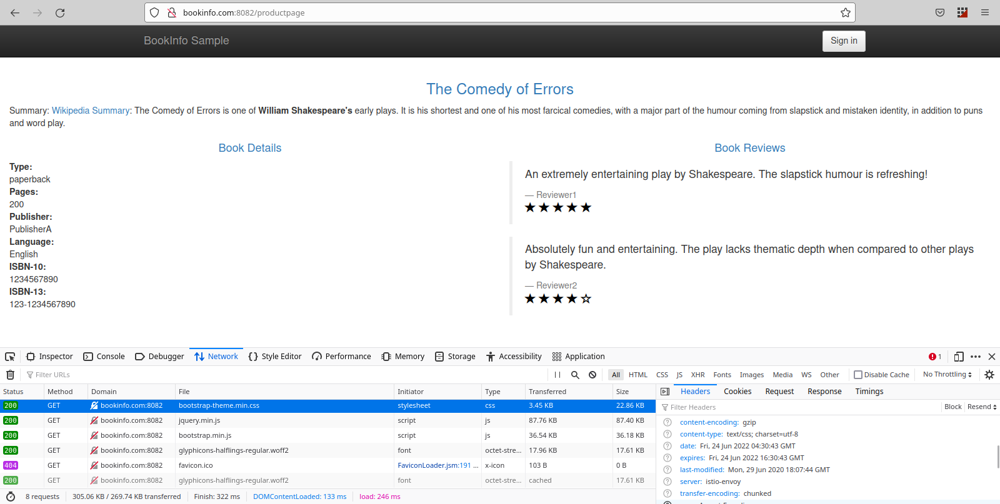
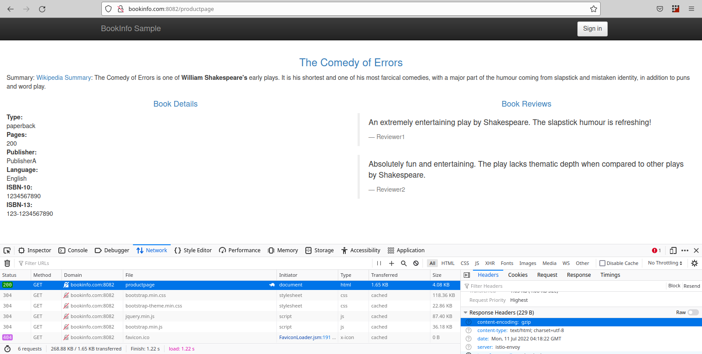

# httpgzip

Httpgzip offers a Custom Resource to enable http gzip compression for your services in a Kubernetes cluster (with Istio installed) without having to understand the complexities of Envoy and Istio. It uses Istio's [`EnvoyFilter`](https://istio.io/latest/docs/reference/config/networking/envoy-filter/) custom resource under the hood. 

### *Note: `httpgzip` has been tested with `1.14.0` version of Istio*
Please [create an issue](https://github.com/vadasambar/httpgzip/issues/new) and mention `@vadasambar` if you want to use this controller for other versions of Istio.

## Custom resource
```yaml
apiVersion: apps.vadasambar.com/v1alpha1
kind: HttpGzip
metadata:
  name: httpgzip-sample
spec:
  applyTo:
    # supports [gateway, pod]
    kind: pod
    # apply gzip compression to the kind with the following labels
    selector:
      app: productpage
```
Above creates an `EnvoyFilter` resource which looks like [this](./testfiles/envoy_gateway_filter.yaml
) for Istio Gateways and like [this](./testfiles/envoy_pod_filter.yaml) for K8s Pods.

Before (notice the bottom right part of the screenshot. You can see gzip is not enabled):

After applying the `HttpGzip` custom resource (notice the bottom right part of the screenshot):

## Getting Started
You’ll need a Kubernetes cluster to run against. You can use [KIND](https://sigs.k8s.io/kind) or [K3D](https://k3d.io/v5.4.3/) to get a local cluster for testing, or run against a remote cluster.
**Note:** Your controller will automatically use the current context in your kubeconfig file (i.e. whatever cluster `kubectl cluster-info` shows).

### Running on the cluster
1. Build and push your image to the location specified by `IMG`:
	
```sh
make docker-build docker-push IMG=<some-registry>/httpgzip:tag
```
	
2. Deploy the controller to the cluster with the image specified by `IMG`:

```sh
make deploy IMG=<some-registry>/httpgzip:tag
```
^ this installs `CustomResourceDefinition`s as well.

3. Install Instances of Custom Resources:

```sh
kubectl apply -f config/samples/
```

### Undeploy controller
UnDeploy the controller to the cluster:

```sh
make undeploy
```

## FAQ
### How do I test if the EnvoyFilter works?
1. You can create a k3d cluster with LoadBalancer like this:
```
k3d cluster create mycluster -p "8082:80@loadbalancer" --k3s-server-arg "--kube-proxy-arg=conntrack-max-per-core=0"  --k3s-agent-arg "--kube-proxy-arg=conntrack-max-per-core=0" --agents 5 --registry-create
```
`8082:80@loadbalancer` exposes LoadBalancer at 8082 port of localhost (check [official docs](https://k3d.io/v5.4.3/usage/exposing_services/) for more info).  
2. Map your host name in VirtualService/Gateway to 127.0.0.1 in etc/hosts like this:
```
suraj@suraj:~$ cat /etc/hosts
127.0.0.1	localhost
127.0.0.1	helloworld.com
127.0.0.1	bookinfo.com
...
```
3. Access the host in browser using url like `http://bookinfo.com:8082/productpage` 
4. Check the response headers in browser developer tools to see if gzip is enabled or not.

## Contributing
Any contributions are welcome! This project uses Operator Framework. If you find any issues, 
- Create an issue and mention `@vadasambar` OR
- Raise a PR and mention `@vadasambar`.

### How it works
This project aims to follow the Kubernetes [Operator pattern](https://kubernetes.io/docs/concepts/extend-kubernetes/operator/)

It uses [Controllers](https://kubernetes.io/docs/concepts/architecture/controller/) 
which provides a reconcile function responsible for synchronizing resources untile the desired state is reached on the cluster 

### Test It Out
1. Install the CRDs into the cluster:

```sh
make install
```

2. Run your controller (this will run in the foreground, so switch to a new terminal if you want to leave it running):

```sh
make run
```

**NOTE:** You can also run this in one step by running: `make install run`

### Modifying the API definitions
If you are editing the API definitions, generate the manifests such as CRs or CRDs using:

```sh
make manifests
```

**NOTE:** Run `make --help` for more information on all potential `make` targets

More information can be found via the [Kubebuilder Documentation](https://book.kubebuilder.io/introduction.html)

## License

Copyright 2022.

Licensed under the Apache License, Version 2.0 (the "License");
you may not use this file except in compliance with the License.
You may obtain a copy of the License at

    http://www.apache.org/licenses/LICENSE-2.0

Unless required by applicable law or agreed to in writing, software
distributed under the License is distributed on an "AS IS" BASIS,
WITHOUT WARRANTIES OR CONDITIONS OF ANY KIND, either express or implied.
See the License for the specific language governing permissions and
limitations under the License.

